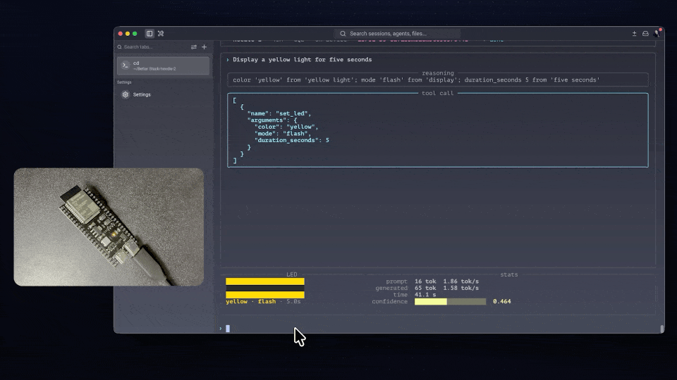

# Needle 2 on an ESP32-S3

A 45M-parameter language model doing grammar-guaranteed tool calling entirely
on a microcontroller. No network, no cloud. The weights are memory-mapped from
flash; you type a request in a terminal and the board's LED does what you asked.



*Two requests, back to back. Each one streams its reasoning, emits a
schema-valid tool call, and drives the onboard RGB LED. Nothing here touches a
network. The clip is sped up — each response takes ~40 s on the board.*

This is an independent C99 implementation of the `.cact` inference format —
about 3,700 lines with no dependencies. It is not derived from Cactus's C++
engine, which has no ESP32 build.

## Hardware

**This targets one specific board.** No attempt is made to be portable across
ESP32 variants; the point was to make one board work well.

| | |
|---|---|
| Chip | ESP32-S3 (Xtensa LX7, dual core) |
| Flash | **16 MB** — the model alone needs 13.1 MB |
| PSRAM | **8 MB octal** (an "N16R8"-class module) |
| LED | WS2812 addressable RGB on **GPIO48** |
| Console | over the **UART bridge** USB port |

A 2 MB or quad-PSRAM part will not work — the KV cache alone is 3.5 MB. If your
board differs, see [Troubleshooting](#troubleshooting) before assuming the code
is broken.

## Performance

Measured on the board above, at 240 MHz:

| | |
|---|---|
| Per token | 534 ms (**1.87 tok/s**) |
| Request, reasoning off | **~25 s** |
| Request, reasoning on | **~47 s** |
| One-time boot prime | ~51 s |

The workload is **compute-bound**, not memory-bound: a GEMV reading weights from
PSRAM takes the same time as from flash, and runtime scales linearly with CPU
clock. Faster flash/PSRAM settings buy nothing.

## Setup

Needs ESP-IDF v5.5+ and Python 3.

```bash
# 1. host tools and the reference implementation
python3 -m venv .venv && .venv/bin/pip install numpy rich pyserial \
    huggingface_hub sentencepiece

# 2. fetch the 13.7 MB model (not committed)
.venv/bin/python -c "
from huggingface_hub import hf_hub_download; import shutil, os
os.makedirs('model', exist_ok=True)
shutil.copy(hf_hub_download('Cactus-Compute/needle2','needle2.cact'),
            'model/needle2.cact')"

# 3. host engine, for rehearsing without the board
cmake -S host -B build -DCMAKE_BUILD_TYPE=Release && cmake --build build -j8

# 4. firmware -- ESP-IDF must be on PATH first
. $HOME/esp/esp-idf/export.sh
cd esp32/needle_demo
idf.py set-target esp32s3 && idf.py build
idf.py -p /dev/cu.usbmodemXXXX flash

# 5. the model, into its own flash partition (~3 min)
cd ../..
esptool.py --chip esp32s3 -p /dev/cu.usbmodemXXXX -b 921600 \
    write_flash 0x210000 model/needle2.cact
```

Find your port with `ls /dev/cu.usb*` (macOS) or `ls /dev/ttyUSB*` (Linux).
The model only needs reflashing if you change it -- firmware iterations are
just step 4.

Then:

```bash
.venv/bin/python tools/needle_tui.py --serial /dev/cu.usbmodemXXXX
```

The board primes its prompt prefix once (progress bar with an ETA), pulses the
LED green three times, and waits for input. `--local` runs the same UI against
the host engine if you want to try it without hardware.

## Using your own tools

Nothing in `engine/` needs to change — the grammar is compiled from your schema
at runtime. Three steps:

**1. Describe the tool** in `tools/led.json`. This is the single source of
truth; the firmware's C string is generated from it at build time.

```json
[{"name":"set_servo","description":"Rotate a servo",
  "parameters":{"type":"object","properties":{
    "channel":{"type":"integer","minimum":0,"maximum":3},
    "degrees":{"type":"integer","minimum":0,"maximum":180}},
  "required":["channel","degrees"]}}]
```

**2. Write a handler** in `esp32/needle_demo/main/main.c`, between the
`YOUR TOOLS START HERE` / `END HERE` markers:

```c
static void tool_set_servo(const char *args)
{
    int ch  = (int)arg_num(args, "channel", 0);
    int deg = (int)arg_num(args, "degrees", 90);

    printf("ACT servo channel=%d degrees=%d\n", ch, deg);
    fflush(stdout);
    servo_write(ch, deg);            /* your hardware */
}
```

`arg_str`, `arg_num` and `arg_bool` read fields. The call is
grammar-constrained, so fields are guaranteed present, correctly typed, and
within any declared `minimum`/`maximum` — no validation needed.

**3. Register it** in the same file:

```c
static const struct { const char *name; tool_fn fn; } TOOL_TABLE[] = {
    { "set_servo", tool_set_servo },
};
```

Rebuild and flash. Print one `ACT <what> k=v ...` line so the TUI can show what
happened, or `ACT none` if nothing matched.

### What the model can and cannot do

It is a **dispatcher, not a chatbot** — every reply is a tool call or the empty
call `[]`. No world knowledge, no free text.

Constraints worth knowing before designing a schema:

- **The 256-token window is the real limit.** The example schema costs 104
  prompt tokens; adding a second tool takes it to 182. Two or three fit; past
  ~5 the upstream design uses a tool-retrieval head this port does not
  implement. Routing between two tools was verified to match the reference
  engine.
- **Supported types:** `string` (with `enum`), `integer`, `number`, `boolean`.
  Nested objects and arrays are rejected at compile time with a readable error,
  rather than silently going unenforced.
- **Names ≤ 39 characters** (`ND_GR_STRLEN`).
- **Descriptions are load-bearing.** `"solid or blink"` on the `mode` field is
  what makes "blink the light red" produce `flash`. A more verbose description
  got it wrong. Treat wording as a tuning knob.
- **Values must be evidenced in the text.** The model omits fields it cannot
  ground rather than guessing. `confidence` measures groundedness, not
  correctness — a correct call needing a unit conversion ("half a second" → 500)
  scores low.
- Schema size drives boot time: roughly 0.5 s per prompt token, once.
- **Formatting of the JSON is handled for you.** The schema is compacted before
  it reaches the model, because Needle was trained on whitespace-free schemas
  and an indented one degrades it *silently* - in testing it began citing tools
  that were never declared, with no error anywhere. Indent your schema freely.

## Troubleshooting

Three settings account for nearly every problem on this hardware. All three
fail *silently*, so check them first.

**No serial output, but the board is clearly running.** The console is on the
UART bridge, not USB-Serial/JTAG. Leave `CONFIG_ESP_CONSOLE_*` at its default.
Setting `CONFIG_ESP_CONSOLE_USB_SERIAL_JTAG=y` produces a board that runs and
emits nothing, while ROM boot messages still appear over the same port — which
makes it look like a crash.

**Boot loop with no error message.** PSRAM line mode. 8 MB parts are *octal*:

```
CONFIG_SPIRAM_MODE_OCT=y
CONFIG_SPIRAM_SPEED_80M=y
```

Quad mode gives `E quad_psram: PSRAM chip is not connected, or wrong PSRAM
line mode` — but only once the console works, which is why the two failures
together are hard to unpick.

**It runs but is ~1.5x too slow.** ESP-IDF defaults the ESP32-S3 to 160 MHz.
`CONFIG_ESP_DEFAULT_CPU_FREQ_MHZ_240=y` is the documented maximum, not an
overclock.

`idf.py monitor` needs a TTY; use `tools/mon.py` in scripts.

**Want a timing breakdown?** Uncomment the `ND_PROFILE` line in
`esp32/needle_demo/components/needle/CMakeLists.txt` for per-phase milliseconds
at boot. It is off by default because the timers cost a little speed.

## Verifying a build

The engine is checked against independent references, so a fork can prove it
is still correct:

```bash
.venv/bin/python tools/check_engine.py model/needle2.cact ./build/nd_dump
.venv/bin/python tools/check_tokenizer.py model/needle2.cact ./build/nd_dump
./build/nd_gtest
cd tools && ../.venv/bin/python ref_forward.py ../model/needle2.cact --int8-kv
```

| Check | Expected |
|---|---|
| CQ2/CQ4 dequant + GEMV vs NumPy | < 3e-07 |
| Tokenizer vs SentencePiece | exact, 15/15 |
| 27-layer forward vs NumPy reference | ~2.5e-05, identical argmax |
| Grammar | 18/18 |

`ref_forward.py` is a NumPy re-implementation of the architecture reading the
same `.cact` blob — full-sequence and non-incremental, so comparing against it
also validates the KV cache and its ring buffer.

## Layout

```
engine/     portable C99 engine, no dependencies
  nd_cact.c       .cact v3 container reader
  nd_quant.c      Cactus-Quants kernels (pair-LUT GEMV, FWHT)
  nd_tokenizer.c  SentencePiece BPE
  nd_model.c      Simple Attention Network forward pass
  nd_grammar.c    JSON schema -> byte-level grammar
  nd_sample.c     grammar-constrained sampling
esp32/needle_demo/  ESP-IDF app: mmap, WS2812, serial protocol
host/               CLI harness and grammar tests
tools/              TUI, validation scripts, canonical tool schema
```

## Credits

Needle 2 and its weights are by [Cactus Compute](https://github.com/cactus-compute/needle),
Apache 2.0. This engine is an independent implementation of the published
`.cact` format and the architecture described in
[arXiv:2607.18363](https://arxiv.org/abs/2607.18363).
